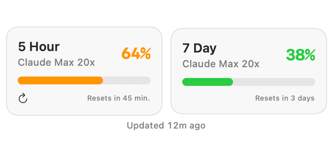
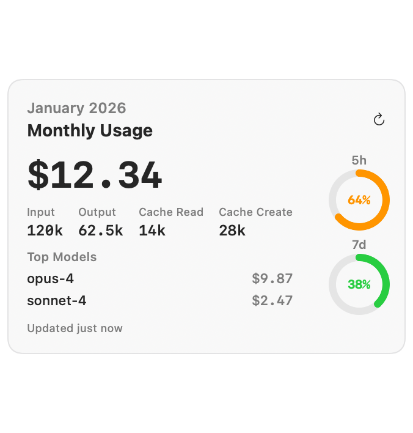
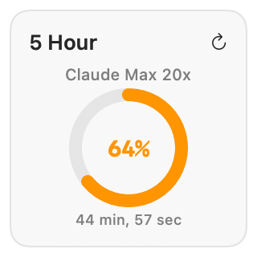
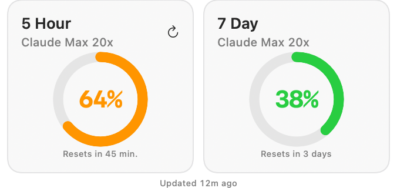
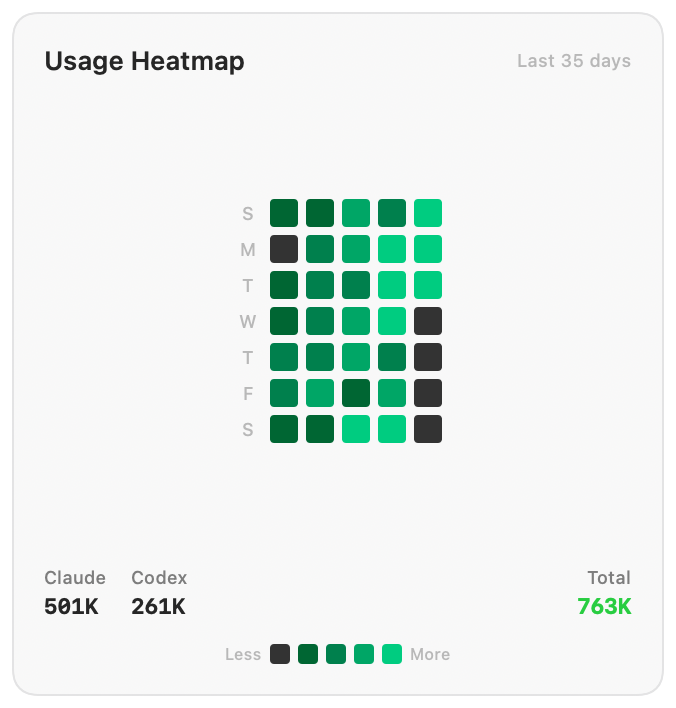
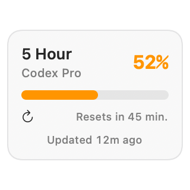
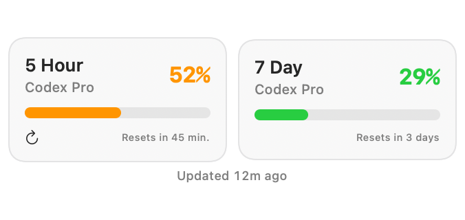
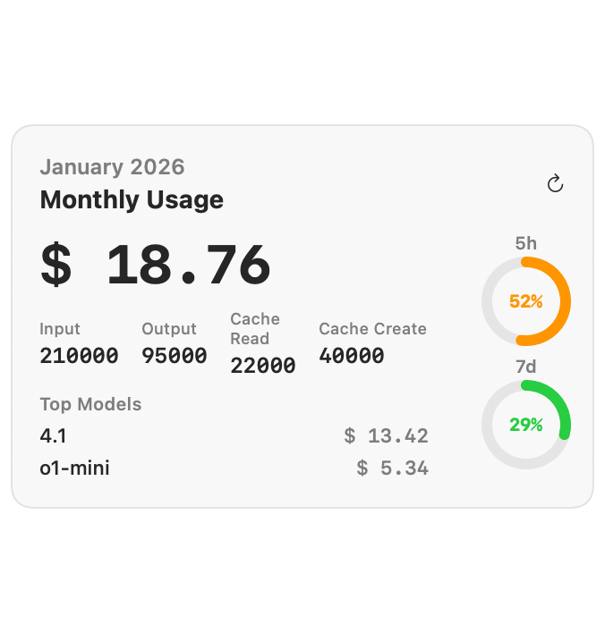
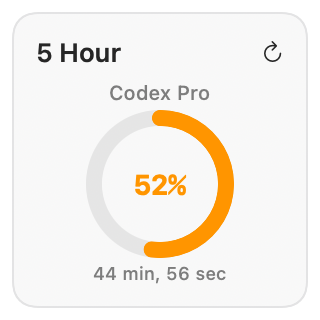
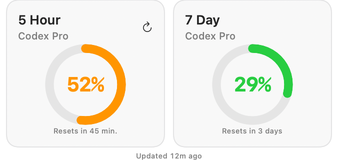

# Claude Usage Widget

Track Claude usage directly on your macOS desktop with native widgets.

  <picture>
    <source media="(prefers-color-scheme: dark)" srcset="docs/widget-snapshots/claude-small-dark.png">
    <source media="(prefers-color-scheme: light)" srcset="docs/widget-snapshots/claude-small.png">
    
  </picture>
  &nbsp;&nbsp;
  <picture>
    <source media="(prefers-color-scheme: dark)" srcset="docs/widget-snapshots/claude-medium-dark.png">
    <source media="(prefers-color-scheme: light)" srcset="docs/widget-snapshots/claude-medium.png">
    
  </picture>
  &nbsp;&nbsp;
  <picture>
    <source media="(prefers-color-scheme: dark)" srcset="docs/widget-snapshots/claude-large-dark.png">
    <source media="(prefers-color-scheme: light)" srcset="docs/widget-snapshots/claude-large.png">
    
  </picture>

  <picture>
    <source media="(prefers-color-scheme: dark)" srcset="docs/widget-snapshots/claude-gauge-small-dark.png">
    <source media="(prefers-color-scheme: light)" srcset="docs/widget-snapshots/claude-gauge-small.png">
    
  </picture>
  &nbsp;&nbsp;
  <picture>
    <source media="(prefers-color-scheme: dark)" srcset="docs/widget-snapshots/claude-gauge-medium-dark.png">
    <source media="(prefers-color-scheme: light)" srcset="docs/widget-snapshots/claude-gauge-medium.png">
    
  </picture>

  <picture>
    <source media="(prefers-color-scheme: dark)" srcset="docs/widget-snapshots/claude-heatmap-large-dark.png">
    <source media="(prefers-color-scheme: light)" srcset="docs/widget-snapshots/claude-heatmap-large.png">
    
  </picture>

  <picture>
    <source media="(prefers-color-scheme: dark)" srcset="docs/widget-snapshots/codex-small-dark.png">
    <source media="(prefers-color-scheme: light)" srcset="docs/widget-snapshots/codex-small.png">
    
  </picture>
  &nbsp;&nbsp;
  <picture>
    <source media="(prefers-color-scheme: dark)" srcset="docs/widget-snapshots/codex-medium-dark.png">
    <source media="(prefers-color-scheme: light)" srcset="docs/widget-snapshots/codex-medium.png">
    
  </picture>
  &nbsp;&nbsp;
  <picture>
    <source media="(prefers-color-scheme: dark)" srcset="docs/widget-snapshots/codex-large-dark.png">
    <source media="(prefers-color-scheme: light)" srcset="docs/widget-snapshots/codex-large.png">
    
  </picture>

  <picture>
    <source media="(prefers-color-scheme: dark)" srcset="docs/widget-snapshots/codex-gauge-small-dark.png">
    <source media="(prefers-color-scheme: light)" srcset="docs/widget-snapshots/codex-gauge-small.png">
    
  </picture>
  &nbsp;&nbsp;
  <picture>
    <source media="(prefers-color-scheme: dark)" srcset="docs/widget-snapshots/codex-gauge-medium-dark.png">
    <source media="(prefers-color-scheme: light)" srcset="docs/widget-snapshots/codex-gauge-medium.png">
    
  </picture>

## Features
- 5-hour and 7-day usage widgets for Claude and ChatGPT (Codex)
- Monthly usage breakdowns and cost estimates
- Daily heatmap combining Claude and (optional) Codex logs
- Optional notifications at usage thresholds
- Runs quietly in the background with Start at Login support

## Requirements
- macOS 14+ (Sonoma or newer)
- Claude Code installed and signed in
- Optional: Codex CLI usage/logs for Codex widgets and heatmap data

## Privacy
- Uses the existing Claude Code OAuth token from macOS Keychain to query usage.
- Reads local logs from `~/.claude/projects` (Claude) and `~/.codex/sessions` (Codex).
- Caches usage in the app's App Group container; **tokens are never stored**.
- No telemetry; network calls are limited to the Anthropic usage API and (if Codex widgets are enabled) the ChatGPT usage endpoint used by the Codex/ChatGPT CLI (`https://chatgpt.com/backend-api/wham/usage`, which is not a public API and may change).

## Getting Started
1. Install the app (from a release build or by building locally).
2. Open the app once so macOS registers the widgets.
3. Add widgets from the macOS Widget Gallery.
4. Optional: run Codex CLI to generate logs for Codex widgets.

## Development

See [DEVELOPMENT.md](DEVELOPMENT.md) for build instructions, architecture details, and contribution guidelines.
